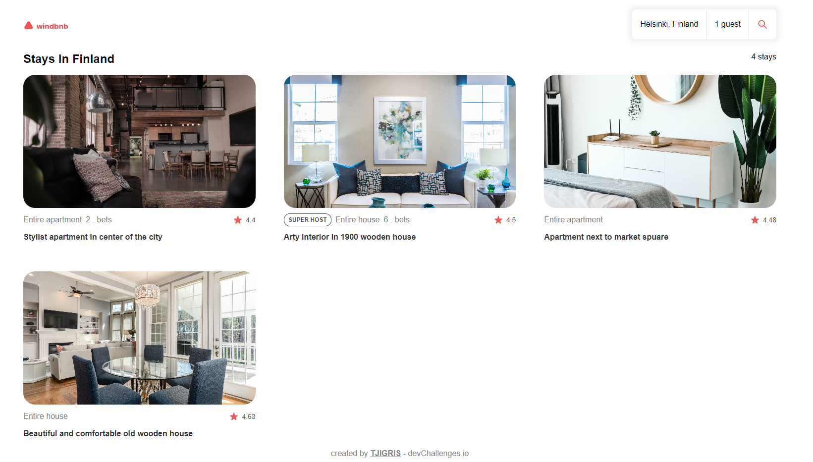

<!-- Please update value in the {}  -->

<h1 align="center">WINDBNB-TJIGIRS</h1>

<div align="center">
   Solution for a challenge from  <a href="http://devchallenges.io" target="_blank">Devchallenges.io</a>.
</div>

<div align="center">
  <h3>
    <a href="https://{tjigris.github.io/WINDBNB-TJIGRIS/}">
      Demo
    </a>
    <span> | </span>
    <a href="https://{github.com/TJIGRIS/WINDBNB-TJIGRIS.git}">
      Solution
    </a>
    <span> | </span>
    <a href="https://devchallenges.io/challenges/3JFYedSOZqAxYuOCNmYD">
      Challenge
    </a>
  </h3>
</div>

<!-- TABLE OF CONTENTS -->

## Table of Contents

- [Overview](#overview)
  - [Built With](#built-with)
- [Features](#features)
- [How to use](#how-to-use)
- [Contact](#contact)

<!-- OVERVIEW -->

## Overview

<!--  -->



- Where can I see your demo?

The web application can be seen in my github and on the devchallenges page.

- What was your experience?

I liked to test my capabilities and see that I can do this, but I am a little upset because I did not manage to do well the filter component and what is inside it, it works correctly but for me it is not very practical the way I did that part, with the other components if I am satisfied because I used good practices.

- What have you learned/improved?

Improved my time by doing these projects and bug fixes.

- Your wisdom? :)

Don't give up until the end

### Built With

<!-- This section should list any major frameworks that you built your project using. Here are a few examples.-->

- [React](https://reactjs.org/)
- [Tailwind](https://tailwindcss.com/)

## Features

<!-- List the features of your application or follow the template. Don't share the figma file here :) -->

This application/site was created as a submission to a [DevChallenges](https://devchallenges.io/challenges) challenge. The [challenge](https://devchallenges.io/challenges/3JFYedSOZqAxYuOCNmYD) was to build an application to complete the given user stories.

## How To Use

<!-- Example: -->

To clone and run this application, you'll need [Git](https://git-scm.com) and [Node.js](https://nodejs.org/en/download/) (which comes with [npm](http://npmjs.com)) installed on your computer. From your command line:

```bash
# Clone this repository
$ git clone https://github.com/TJIGRIS/WINDBNB-TJIGRIS.git

# Install dependencies
$ npm install

# Run the app
$ npm start
```

## Contact

- Website [your-website.com](https://{your-web-site-link})
- GitHub [@your-username](https://{github.com/your-usermame})
